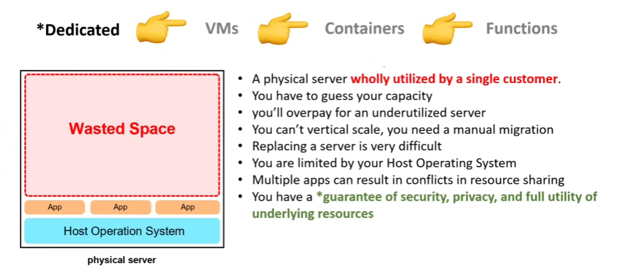
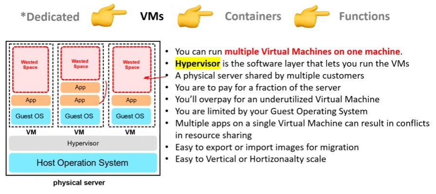
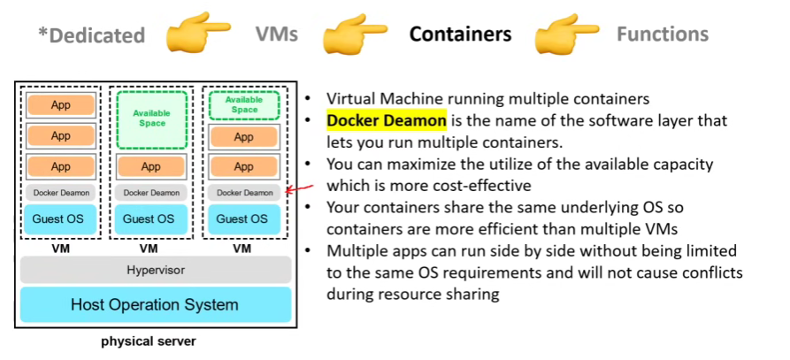
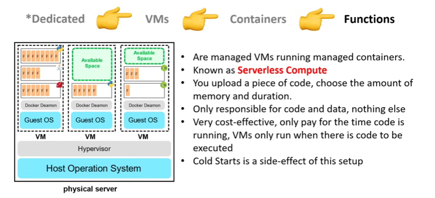

# AWS Certified Cloud Practitioner Certification Course

---

### Table of Contents

1. [AWS Certification Path](https://d1.awsstatic.com/training-and-certification/docs/AWS_certification_paths.pdf)
2. [Exam Guide](https://d1.awsstatic.com/training-and-certification/docs-cloud-practitioner/AWS-Certified-Cloud-Practitioner_Exam-Guide.pdf)
3. [What is Cloud?](#3-what-is-cloud)
   - [Benefits of Cloud Computing](#3-1-benefits-of-cloud-computing)
4. [What is AWS?](#4-what-is-aws)
5. [First AWS Services?](#5-first-aws-services)
6. [What is a Cloud Service Provider?](#6-what-is-a-cloud-service-provider)
7. [Landscape of CSPs](#7-landscape-of-csps)
8. [Common Cloud Services](#8-common-cloud-services)
9. [Technology Overview](#9-technology-overview)
10. [The Evolution of Computing](#10-the-evolution-of-computing)
11. [Types of Cloud Computing](#11-types-of-cloud-computing)
12. [Cloud Computing Models](#12-cloud-computing-models)

- [Video Tutorial](https://www.youtube.com/watch?v=NhDYbskXRgc)

---

## 3. What is Cloud?

Cloud computing is a model of delivering computing resources and services over the internet, often referred to as "the cloud." Instead of owning and maintaining physical hardware like servers and data centers, organizations and individuals can rent or use these resources on-demand from cloud service providers such as AWS (Amazon Web Services), Microsoft Azure, or Google Cloud Platform.

### Benefits of Cloud Computing

- **Cost Efficiency**: Reduces capital expenditure (CapEx) by eliminating the need for physical hardware.
- **Flexibility**: Access resources anytime, anywhere.
- **Speed**: Rapid deployment of resources.
- **Security**: Advanced security measures, including encryption and compliance certifications.
- **Innovation**: Encourages experimentation by reducing barriers to entry.

## 4. What is AWS?

Collection of cloud services that can be used together under a single unified API to build diferent kind of workflows. AWS Launched in 2006, cloud leading provider.
Cloud Service Providers = CSPs

## 5. First AWS Services?

Simple Queue Service (SQS) launched 2004

Simple Storage Service (S3) launched March of 2006

Elastic Compute Cloud (EC2) launched August of 2006

Amazon migrated all their retail sites to AWS November 2010

AWS Began offering certification program for computer engineers, on April 2013

## 6. What is a Cloud Service Provider?

A Cloud Service Provider (CSP) is a company which:

- provides multiple Cloud Services e.g. tens to hinders of services.
- those Cloud Services can be chained together to create a cloud architectures.
- those Cloud Services are accessible via Single Unified API e.g. AWS API
- those Cloud Services utilized metered billing based on usage e.g. per second, per hour, etc.
- those Cloud Services have rich monitoring built in e.g. AWS CloudTrail.
- those Cloud Services have an Infrastructure as a Service (IaaS) offering.
- those Cloud Services offers automation via Infrastructure as Code (IaC)

## 7. Landscape of CSPs

Tier 1 - AWS, Azure, Google Cloud Platform (GCP), Alibaba Cloud
Tier 2 - IBM, Oracle, Huawei, Tencent
Tier 3 - Vultr, Digital Ocean, Akamai
Tier 4 - Openstack, Apache CloudStack, Vmware vSphere

## 8. Common Cloud Services

AWS alone has over 200+ cloud services.

The top 4 on each cloud:

Compute: Virtual computer that can run application, programs and code.

Networking: Virtual Network defining internet connections or network isolations between services or outbound to the internet.

Storage: Virtual hard-drive that can store files.

Databases: Virtual database for storing reporting data or a database for general purpose web-application.

The term "Cloud Computing" can be used to refer to all categories, even though it has "compute" in the name.

## 9. Technology Overview

[AWS Services List](https://aws.amazon.com/es/products/?nc2=h_ql_prod&aws-products-all.sort-by=item.additionalFields.productNameLowercase&aws-products-all.sort-order=asc&awsf.re%3AInvent=*all&awsf.Free%20Tier%20Type=*all&awsf.tech-category=tech-category%23analytics)

## 10. The Evolution of Computing

### Dedicated

### Virtual Machines (VMs)

### Containers

### Functions

## 11. Types of Cloud Computing

SaaS - Software as a Service: Product that is run and managed by service provider. Don't worry about how the service is maintained, it just works and remains available. (For Customers) e.g. SalesForce, Gmail, Office 365.
PaaS - Platform as a Service: Focus on deployment and management of apps. Don't need to worry about, provisioning, configuring, or understanding hardware. (For Developers) e.g. Ec2, Heroku, etc.
IaaS - Infrastructure as a Service: Basic building blocks for cloud It. Provides access to networking features, comnputes and data storage space. Don't worry about It stuff, data centers and hardware. (For Admins) e.g. Azure, AWS, GCP.

## 12. Cloud Computing Models

Public Cloud: Everything(workload or project) is buildt on the CSP. Also known as Cloud-Native.

Private Cloud: Everything built on company's datacenters. Also known as On-Premise.

Hybrid: Using both On-Premise and a Cloud Service Provider.

Cross-Cloud: Using Multiple Cloud Providers. e.g. Amazon EKS - Azure Arc - GCP Kubernetes Engine.
