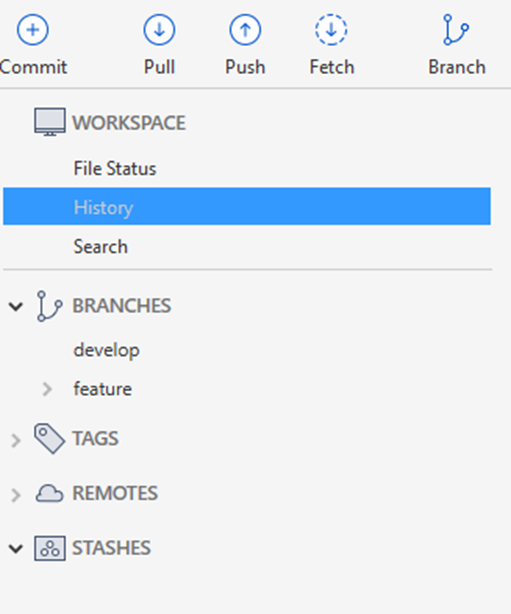
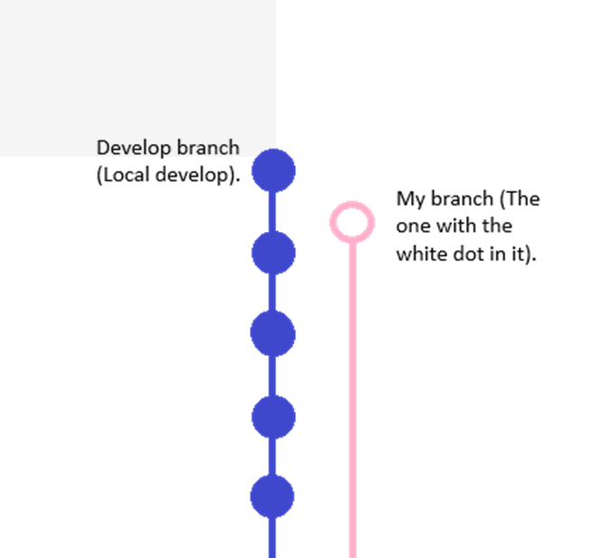
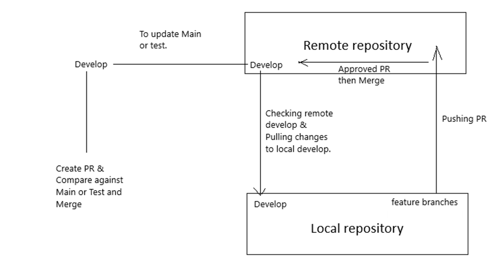
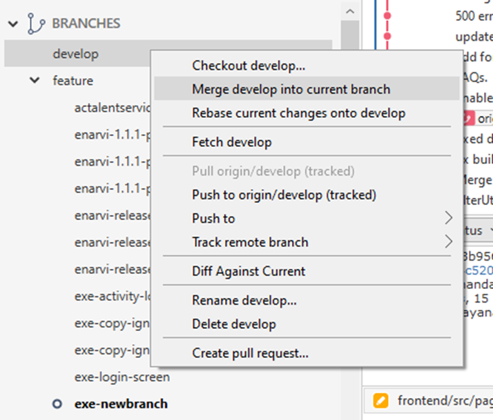
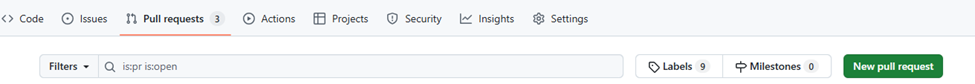
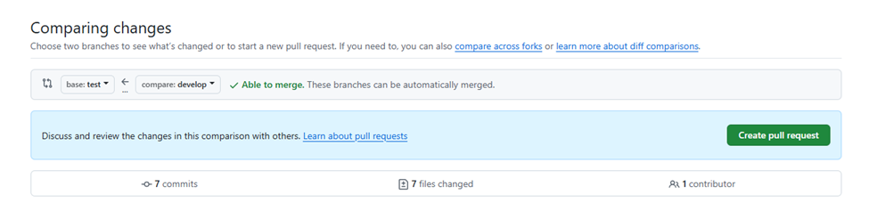
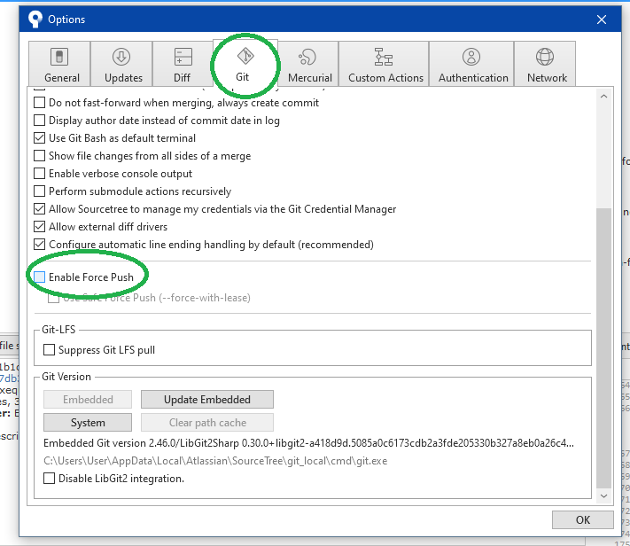
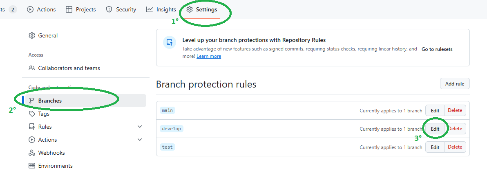
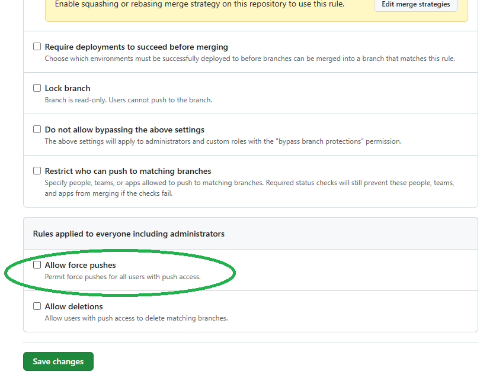

# Git Flow Using SourceTree

## What is GitHub?

GitHub is a website and platform that hosts your Git repositories online. It makes it easy to share and collaborate on code with others. GitHub allows developers to store their code, track changes, and work together on projects. It also provides features like issue tracking, pull requests (for code review), and team collaboration tools. With GitHub, you can store your code remotely and easily access it from anywhere.

- [GitHub](https://github.com/)

---

Using SourceTree as a tool for better visualization, you can see local and remote branches in the left menu. This includes your local `develop` branch and your `feature` branch, which is an exact copy of `develop` where you will be working.

---

## Table of Contents

1. [Keeping Your Local `develop` Up to Date](#1-keeping-your-local-develop-up-to-date)
2. [Updating Your Feature Branch](#2-updating-your-feature-branch)
3. [Creating a Pull Request (PR)](#3-creating-a-pull-request-pr)
4. [Updating Main and Test Branches](#4-updating-main-and-test-branches)
5. [Video Tutorial](#5-video-tutorial)
6. [Force Push](#6-force-push)
7. [Git Rules](#7-git-rules)

---

## 1. Keeping Your Local `develop` Up to Date

### Check the Branch Status

- Ensure you are on the `develop` branch. This is indicated by the circle next to the branch name.

### Fetch Updates

- Fetch either the remote `develop` branch individually or fetch all remote branches to see updates to `develop` and other developers’ feature branches.

### Pull Changes

- If there are updates in remote `develop`, pull those changes and commit them to your local `develop` branch.
- **Note:** Always pull changes from remote `develop` into your local branch, not the other way around.

---

## 2. Updating Your Feature Branch

### Switch to Your Feature Branch

- Ensure you are working on your feature branch by confirming the circle next to its name.

### Merge Changes from Local `develop`

- Select your local `develop` branch with the latest changes and merge them into your feature branch.

### Resolve Conflicts

- If any conflicts arise during the merge, resolve them before proceeding.

### Push Changes

- Once your feature branch is updated, push your changes to the remote repository to prepare for a Pull Request (PR).

---

## 3. Creating a Pull Request (PR)

### Option 1: Using SourceTree

1. Push your updated feature branch to the remote repository.
2. Use the GitHub interface to create a new PR (see Option 2 below).

### Option 2: Directly on GitHub

1. Navigate to the **Pull Requests** tab.
2. Click on **New Pull Request**.
3. Select the base branch (e.g., `develop` or `main`) and compare it with your feature branch.
4. Submit the PR for review.

---

## 4. Updating Main and Test Branches

- Use the same Pull Request process described above.
- Set the base branch to `main` or `test` and compare it with `develop`.

---

## 5. Video Tutorial

Watch the explanatory video for a detailed walkthrough:  
[Git Flow Video](https://www.youtube.com/watch?v=K-pI_qSKDfo)

## 6. Git Rules

In GitHub, repository admins can set branch protection rules to enforce policies (like preventing force pushes or requiring reviews before merging).

These rules are managed in GitHub → Repository Settings → Branches

## 7. Force Push

Force Push is like overwriting the remote Git history with your local changes, even if it causes conflicts. It’s powerful but risky—so we have to be careful to avoid messing up others' work!

We can take our local develop branch and replace the remote develop, but any changes made after the point we're reverting to will be lost. For example, if we’ve made changes up until March 31 and we force push back to March 23, everything after March 23 will be erased. This includes both our own work and any contributions from teammates, so we need to be absolutely sure of what we’re doing.

### Step 1

In SourceTree, there are a few steps we need to follow first. By default, it won’t allow us to force push, so we have to enable it manually before proceeding.

First Lets select tools:

Then GIT, and lets check allow Force Push.

### Step 2

For force push to be able to work, we must be sure that we allow force push in the branch.

So let's head up to our repository, then Settings, then Branches.

Once there, we can edit the branch we want to force push, in this case, it's develop. We click edit, then we scroll down and allow force push, then save.

After we have done our push, let's head back and remove the "Allow Force Push," and that's all. If everything went well, we force-pushed, recovered our changes, and left the rules like they were before.
