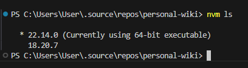

# Node.js and NVM Guide

## What is Node.js?

Node.js is a JavaScript runtime built on Chrome's V8 JavaScript engine. It allows us to run JavaScript code outside a web browser, on the server side. Node.js uses an event-driven, non-blocking I/O model that makes it lightweight and efficient, perfect for data-intensive real-time applications that run across distributed devices.

Key features of Node.js:

- Server-side JavaScript execution
- Built on Chrome's V8 engine
- Event-driven architecture
- Non-blocking I/O operations
- Large ecosystem of packages via npm (Node Package Manager)

## What is NVM?

NVM (Node Version Manager) is a tool that allows us to install and manage multiple Node.js versions on our system. This is particularly useful when working on different projects that require specific Node.js versions.

## Installing NVM

### On Linux/macOS

Install NVM using curl:

```bash
curl -o- https://raw.githubusercontent.com/nvm-sh/nvm/v0.39.3/install.sh | bash
```

Or using wget:

```bash
wget -qO- https://raw.githubusercontent.com/nvm-sh/nvm/v0.39.3/install.sh | bash
```

After installation, we'll need to reload our terminal or source our profile:

```bash
source ~/.bashrc  # For bash
source ~/.zshrc   # For zsh
```

### On Windows

For Windows, use [nvm-windows](https://github.com/coreybutler/nvm-windows). Download the installer from the releases page and follow the installation instructions.

# Installing NVM Globally on Windows

NVM for Windows is a separate implementation from the original NVM (which was designed for Unix-like systems). Here's how to install NVM globally on Windows:

## Step 1: Download the NVM for Windows Installer

1. Visit the official NVM for Windows repository: [https://github.com/coreybutler/nvm-windows/releases](https://github.com/coreybutler/nvm-windows/releases)
2. Download the latest `nvm-setup.exe` from the releases page

## Step 2: Run the Installer

1. Close any open terminal windows or command prompts
2. Run the downloaded `nvm-setup.exe` file as administrator
3. Follow the installation wizard instructions:
   - Accept the license agreement
   - Choose the installation directory (default is fine)
   - Choose the location for Node.js symlink (default is fine)
   - Complete the installation

## Step 3: Verify Installation

1. Open a new Command Prompt or PowerShell window
2. Type the following command to verify NVM is installed:
   ```
   nvm version
   ```

## Step 4: Using NVM on Windows

Once installed, NVM is available globally on our Windows system. Here are some common commands:

```powershell
# List available Node.js versions for installation
nvm list available

# Install a specific Node.js version
nvm install 16.20.0

# Use a specific Node.js version
nvm use 16.20.0

# Set a default Node.js version
nvm alias default 16.20.0

# List installed Node.js versions
nvm list
```

## Important Notes for Windows Users

1. When we use `nvm use`, we need to run the Command Prompt or PowerShell as administrator
2. We may need to specify the full version number (e.g., `16.20.0` instead of just `16`)
3. After switching Node.js versions, we might need to reopen our terminal
4. NVM for Windows stores Node.js versions in `%APPDATA%\nvm` by default

Now we can manage multiple Node.js versions globally on our Windows system!

## Common NVM Commands Summary

| Command                       | Description                        |
| ----------------------------- | ---------------------------------- |
| `nvm install <version>`       | Install a specific Node.js version |
| `nvm use <version>`           | Switch to a specific version       |
| `nvm ls`                      | List installed versions            |
| `nvm ls-remote`               | List available versions to install |
| `nvm current`                 | Show currently active version      |
| `nvm alias default <version>` | Set default Node.js version        |
| `nvm uninstall <version>`     | Uninstall a specific version       |


