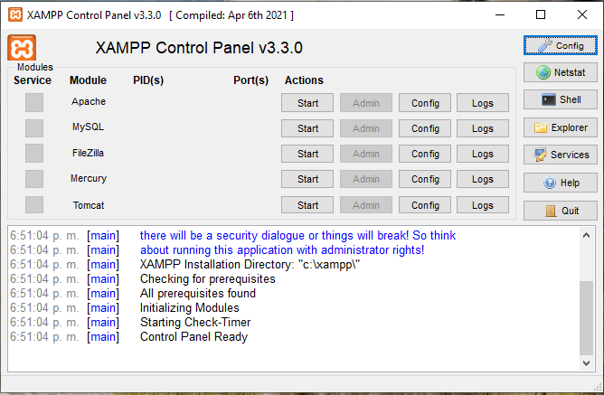
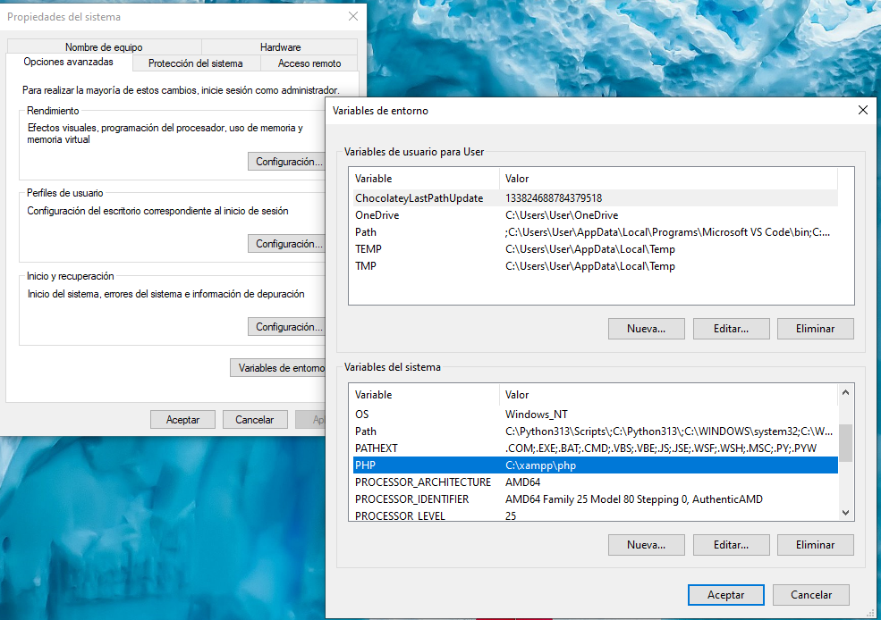

# PHP

PHP is a programming language used to create websites that can change based on user input. It runs on a server and helps manage things like forms, databases, and user logins. When you visit a website with a login system or a shopping cart, PHP is often working behind the scenes to make it function.

You can use PHP for both frontend and backend, but it’s mostly used for backend. The backend handles things like user authentication, database storage, and processing requests. PHP can also generate HTML, CSS, and JavaScript for the frontend, making it possible to create a full website using just PHP. However, modern websites often combine PHP with frontend technologies like JavaScript frameworks for a better user experience.

The most powerfull php web you can check:

[PHP MANUAL](https://www.php.net/manual/en/index.php)

## What is XAMPP?

**XAMPP** is a free software package that lets you run a web server on your own computer. It includes:

- **Apache** – The web server that handles HTTP requests.
- **MySQL/MariaDB** – The database system to store and manage data.
- **PHP** – The programming language for backend development.
- **Perl** – Another scripting language (not always needed).

With XAMPP, you can build and test websites **locally** before putting them online. It’s often used by developers to create and test PHP applications without needing an actual web host.

### Install XAMPP

[Install XAMPP](https://www.apachefriends.org/)

Once we install it, we mostly use the Apache and MySQL services from the control panel. We just hit the Start button on the desired service, and that's it.



We head to our browser and will find our local host at `http://localhost/`, our database at `ttp://localhost/phpmyadmin/`. We can also use 127.0.0.1 as an alternative. Our projects will be located in `C:\xampp\htdocs\`by default.

We can change this by

## Steps to Change the Default Project Directory in XAMPP

1. Open the **XAMPP Control Panel**.
2. Click on **Apache > Config > httpd.conf** (this opens the Apache configuration file).
3. Find the following line:

   ```apache
   DocumentRoot "C:/xampp/htdocs"
   ```

   ```
   DocumentRoot "D:/my_projects"
   <Directory "D:/my_projects">
   ```

## What is Apache?

## What is Mysql?

## What is Composer?

Composer is a dependency management tool for PHP. It helps you manage libraries and packages that your PHP project needs. Instead of manually downloading and managing these libraries, Composer automatically handles the installation, updates, and autoloading of them. It simplifies the process of working with external code and keeps everything organized by using a composer.json file to track the required packages.

[Composer](https://getcomposer.org/)

### Install Composer

[Download](https://getcomposer.org/download/)

1. Locate the downloaded `Composer-Setup.exe` file and run it.
2. During the installation, choose the option **Install for all users** if you want Composer to be available to everyone on the system, or **Install for the current user** if you prefer it to be available only for your account.
3. Ensure that the installer detects the path to the PHP executable. If not, manually provide the full path to the `php.exe` file.
4. Follow the instructions provided by the installer.

We can install PHP separately, or if we install XAMPP, PHP will be installed automatically in `C:/xampp/php/`.

#### Setting Up the Local Environment

1. Press **Windows key + R**, then type `sysdm.cpl` and press Enter.
2. In the next window, go to the **Advanced** tab and click **Environment Variables**.
3. Click **New** under **System Variables**, and add a new variable:
   - **Variable Name**: `PHP`
   - **Variable Value**: `C:/xampp/php/`
4. Click **OK** and restart your system if necessary.



#### Verifying PHP Installation

If PHP is not recognized in PowerShell, navigate to the folder where PHP is installed and run the command:

```bash
./php --version
```

#### Completing the Installation

5. Complete the remaining steps of the installer. If prompted, accept the default options.
6. Finish the installation. The installer will add Composer to the system’s **PATH** environment variables.

#### Verifying the Composer Installation

7. Open a new PowerShell window and type `composer --version`.
8. If the installation was successful, you should see the installed version of Composer.

## What is Laravel?

Laravel is a free, open-source PHP framework for building web applications.

### Features

1. Model-view-controller (MVC): Follows the MVC architectural pattern, which separates an application's logic from its presentation
2. Modular packaging: Includes a dependency manager and ways to access relational databases
3. Tools for deployment and maintenance: Helps with application deployment and maintenance
4. Testing support: Includes unit testing support and a test command
5. Job queues: Offloads slow jobs to a background queue
6. Command-line interfaces: Includes command-line interfaces and an intuitive development environment

### Benefits

Can handle high traffic and complex functionality.
Makes it easier to build robust applications with minimal coding.

### Install Laravel

[Install Laravel](https://laravel.com/docs/11.x)

---

### Useful Commands

**Cleaning**

```bash
# Clean cache
php artisan cache:clear

# Clean route cache
php artisan route:clear

# Clean config cache
php artisan config:clear

# Clean view cache
php artisan view:clear

# Clean all caches
php artisan optimize:clear

# Clean event caches
php artisan event:clear
```

**Configuration**

```bash
# Cache config
php artisan config:cache

# Cache routes
php artisan route:cache

# Cache views
php artisan view:cache

# Reload config no restart (for Laravel Octane)
php artisan config:reload
```

**Autoload**

```bash
# Regenerate composer autoload
composer dump-autoload

# Optimize autoload (PSR-4 and classmap)
composer dump-autoload -o
```

**Database**

```bash
# Exec migrations
php artisan migrate

# Rollback last migration
php artisan migrate:rollback

# Reset all migrations
php artisan migrate:reset

# Create migration
php artisan make:migration create_table_name

# Exec seed
php artisan db:seed

# Migrate + seed
php artisan migrate --seed
```

**Develop**

```bash
# Start dev server
php artisan serve

# List routes
php artisan route:list

# Create model + migration + controller
php artisan make:model ModelName -mc

# Create controller
php artisan make:controller ControllerName

# Create middleware
php artisan make:middleware MiddlewareName
```

**Useful**

```bash
# List all commands
php artisan list

# View help of specific command
php artisan help command-name

# Generate app key
php artisan key:generate

# Clean package cache
php artisan package:discover

# Current app status
php artisan about
```

```

```
