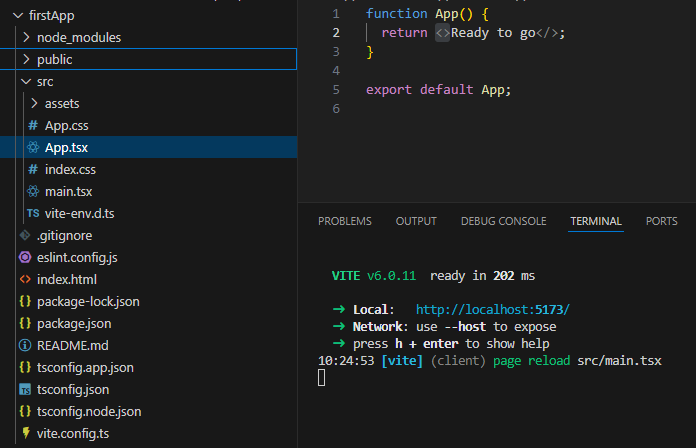

# React

## What is React?

React is a JavaScript library used to create interactive user interfaces, especially for web applications that update without reloading the page. It allows you to build reusable components, which are like building blocks for your site, making it easier to maintain and update. React improves performance by only changing the parts of the page that need updating, using something called the Virtual DOM. It lets you write HTML and JavaScript together in a simple way with JSX. React is popular because it's flexible, efficient, and supported by a large community.

## What is The Virtual DOM?

The Virtual DOM is a concept used by React to improve performance when updating the user interface. It's essentially an in-memory copy of the real DOM (Document Object Model), which is the structure that represents the HTML elements on a web page.

When the state of a React component changes (for example, when a user interacts with the page), React first updates the Virtual DOM, not the real DOM. Then, React compares this updated Virtual DOM with the previous version to find the differences (this process is called reconciliation). Afterward, React updates only the parts of the real DOM that have changed, instead of re-rendering the entire page.

This process makes updates much faster because modifying the Virtual DOM is much quicker than manipulating the real DOM directly. It helps React perform better, especially in complex applications.

## Thinking in React

React can change how you think about the designs you look at and the apps you build. When you build a user interface with React, you will first break it apart into pieces called components. Then, you will describe the different visual states for each of your components. Finally, you will connect your components together so that the data flows through them.


[More detailed explanation](https://react.dev/learn/thinking-in-react)

## What is Vite?

React Vite is a super-fast tool that helps me build and run React apps quickly. Unlike older tools like Create React App, Vite starts instantly, updates changes in real time, and makes my final app smaller and faster. It’s easy to set up, works great with TypeScript, and saves me time while coding.

## Create Vite App and Run

We type `npm create vite@latest` in our terminal, select a framework (in this case, React), and then choose a variant such as JavaScript or TypeScript. Personally, I'll be using TypeScript. (If we select SWC, it's supposedly a faster compiler.) After that, we name the project. If we want to create it in the same folder we’re in, we just type `.` instead.

After this, we can install node_modules by typing `npm install` or `npm i`. If we need to fix or update dependencies, we can check for issues with `npm audit` or fix vulnerabilities with `npm audit fix`.

To run our newly created app, we type: `npm run dev`

And now we got our first App on track. We can check it in our browser in our localhost.



## JSX

In React, JSX stands for JavaScript XML. It's a syntax extension that allows us to write HTML-like code inside JavaScript. This makes it easier to build React components and describe what the UI should look like.

### We can render

**JSX/HTML Elements**

```jsx
<p>Hello</p>
```

**Strings**

```jsx
{
  ;('Hello')
}
```

**Numbers**

```jsx
{
  42
}
```

**Arrays of JSX or renderable values**

```jsx
{
  ;['Item 1', <strong key="2">Item 2</strong>]
}
```

**We won't be able to render**

```jsx
function App() {
  return (
    <div>
      {null} {/_ renders nothing _/}
      {undefined} {/_ renders nothing _/}
      {false} {/_ renders nothing _/}
      {true} {/_ renders nothing _/}
      {NaN} {/_ renders "NaN" _/}
    </div>
  )
}
```

## Exports default export vs named export

Basically with default export will be importing one main thing and with named exports, we will be exporting several functions, components, variables, etc. from the same file.

### Default export

```jsx
// TodoList.js
const TodoList = () => { ... }
export default TodoList;

// Another file:
import TodoList from './TodoList';
```

**We can import it with any name we want**

```jsx
import WhateverName from './TodoList' // still works!
```

### Named export

**We must use the exact name (TodoList) and we must use curly braces when importing**

```jsx
// TodoList.js
export const TodoList = () => { ... }

// Another file:
import { TodoList } from './TodoList';
```

### Named export useful example:

**Lets imagen a utils.js file**

Our utils.js file with several functions

```jsx
export const add = (a, b) => a + b
export const subtract = (a, b) => a - b
export const multiply = (a, b) => a * b
```

To another file

```jsx
import { add, subtract } from './utils'

console.log(add(2, 3)) // 5
```

## Testing Librarys

### Jest

Jest is a testing framework for JavaScript and TypeScript. It helps us automate testing to make sure the code works as expected.

Why does Jest work?
Jest works because it:

- Runs tests automatically – You write test cases, and Jest executes them.
- Mocks dependencies – It can fake API calls or database interactions.
- Uses assertions – We define expected outputs, and Jest checks if the actual results match.
- Works with React & TypeScript – It's optimized for UI testing and supports modern JS features.

Simple example to start using:

```tsx
import { render, screen } from '@testing-library/react'
import App from './App'

test('renders a welcome message', () => {
  render(<App />)
  expect(screen.getByText(/welcome/i)).toBeInTheDocument()
})
```

[Jest Docs](https://jestjs.io/)

### React Testing Library

React Testing Library is a tool for testing React components. It helps to check if the app's buttons, forms, and other elements work as users expect. Instead of focusing on the code behind the scenes, it checks how things look and behave on the screen, just like a user would.

Simple example of Jest working with React Library:

```tsx
test('renders my profile header', () => {
  const myProfileHeader = screen.getByText('My Profile')
  expect(myProfileHeader).toBeInTheDocument()
})
```

- React Testing Library: screen.getByText('My Profile') looks for text inside the rendered UI.
- Jest Assertion: expect(myProfileHeader).toBeInTheDocument() checks if the element exists.
- Jest Reports: If "My Profile" is missing, Jest fails the test and tells us why.

So Jest runs the tests, mocks dependencies, and reports results, React Testing Library renders components and queries elements as a user would.
Together, they simulate a real user interacting with the app, making sure the UI behaves correctly.

[React Testing Library Docs](https://testing-library.com/docs/react-testing-library/intro/)

### Jest vs. React Testing Library

Think of **Jest** as a **test alarm system** 🚨—it **runs tests**, **mocks dependencies**, and **alerts you if something breaks**.

Meanwhile, **React Testing Library** is like a **virtual user** 🧑‍💻—it **renders components, clicks buttons, and checks if things appear on the screen** (just like a real person would).

---
