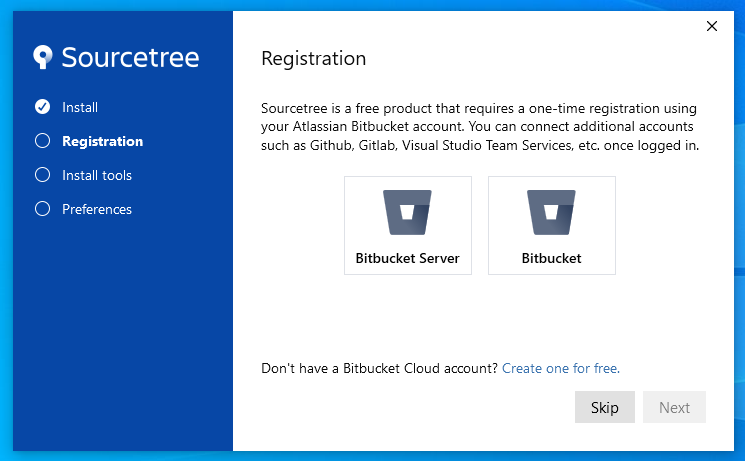
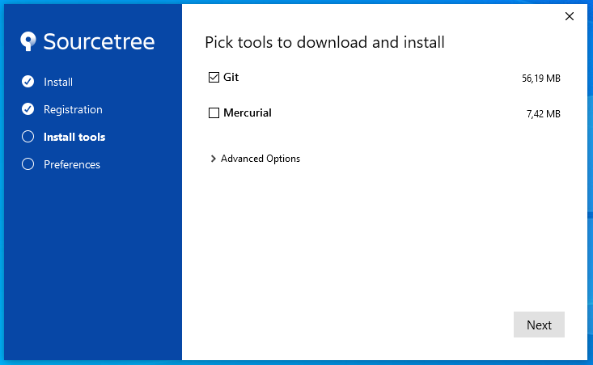
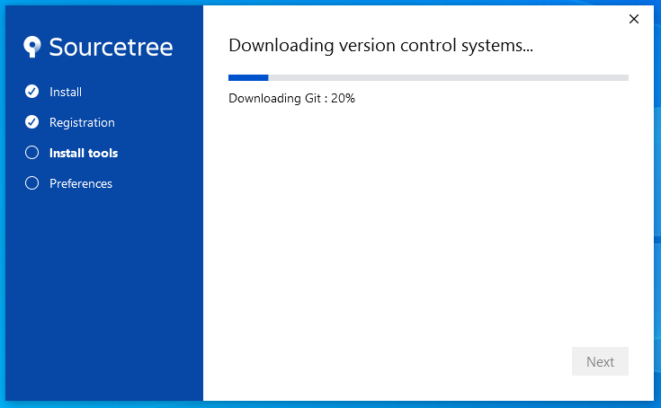
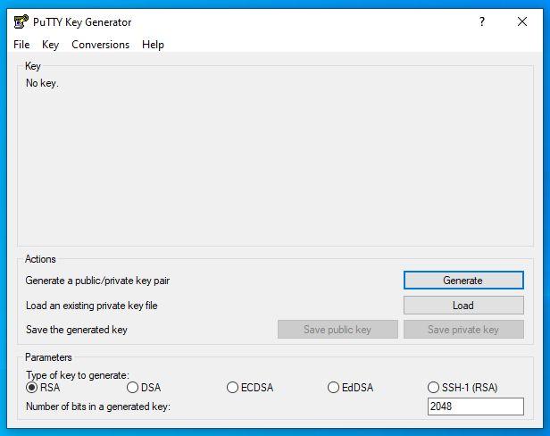
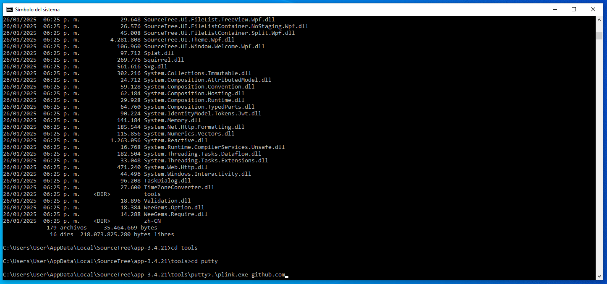
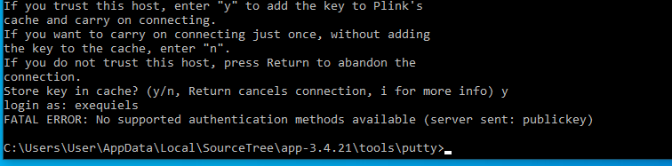
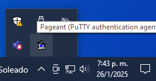
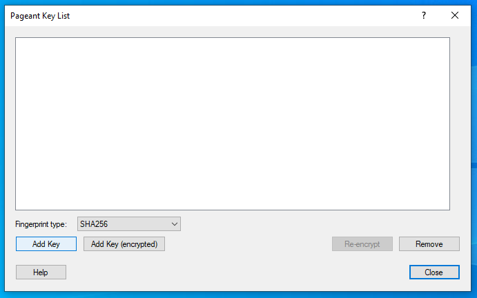
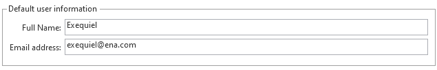

# SourceTree

## What is SourceTree?

SourceTree is a free app that helps us manage code using Git or Mercurial, which are tools that track changes in our code. It gives a visual way to see code history, manage branches, and make changes, without needing to use complex commands. With SourceTree, we can easily commit changes, merge code, and keep everything organized, all through an easy-to-use interface. It's helpful for developers who prefer using graphics rather than typing commands.

---

## Install SourceTree

- [Install SourceTree](https://www.sourcetreeapp.com/)

After running the installation, we will find ourselves at the following screen:

We proceed by clicking **Skip**, and on the next screen, we deselect **Mercurial**.

Finally, we continue with the download and installation process.

The next screen will confirm that everything has been installed and may prompt us to select some directories. These can be configured later, so we can continue for now.

---

## Configure SourceTree

We can now go to **Tools** and launch the option to create or import SSH keys if we don’t already have one. To generate a new key, simply move the cursor around as prompted to generate random input. Once done, save the key in local user directory under a folder named `.ssh`. Save the key twice: once as the **public key** (e.g., `id_rsa.pub`) and once as the **private key** (e.g., `id_rsa.ppk`).

---

### Setting Up the Cloning Path for GitHub

To set up our cloning path correctly for GitHub, we need to apply this workaround.

#### Open a Terminal Window

Navigate to the `AppData` folder in local user directory. Since this is usually a hidden folder, enable the option to view hidden files.

#### Locate the SourceTree Directory

Inside the `AppData` folder, go to the `SourceTree` directory. The folder structure will include the version of SourceTree installed at the time (this may vary from this example):

`\AppData\Local\SourceTree\app-3.4.21\tools\Putty\`

#### Run the Command

In this directory, locate the file `plink.exe` and run the following command to link GitHub:

`.\plink.exe github.com`

Once we do this, we will need to input `(Y)es` to continue.

It will then ask for a username to log in, but this doesn’t really matter—just input anything or an actual username.

Once everything is done correctly, you will see in SourceTree, next to the text **Repository Type**, an icon and a message saying **"This is a Git repository"**. Before this, it couldn't recognize it as such.

---

## Adding Our Private Key to SourceTree

We’re almost finished setting this up. Now let’s add our private key.

1. Go to the system tray and search for **Pageant** as shown in the image below.  
   

2. Once located, add the private key that we created earlier.  
   

---

## Default User

During the installation of SourceTree, the final installation screen prompted us to add our name and email. If we didn’t set that up correctly or made a mistake, we can change or add it by navigating to:

**Tools > Settings > Default User**

In the same screen, we can also change the key associated with our account.

This user information will appear in the **SourceTree History Author** tab when we commit changes.

---

## Suggestions

To ensure our files and repositories are well-organized, consider these practices:

1. Save PuTTY keys under user directory in a folder named `.ssh`. For example:  
   `C:\Users\<YourUsername>\.ssh`

2. Store repositories in a dedicated folder under user directory. A common setup is:  
   `C:\Users\<YourUsername>\source\repos`

3. Inside the `repos` folder, we create a subfolder for each repository we plan to clone. This helps us to keep projects organized.

4. We can also configure the clone path directly in SourceTree to match this structure for easier management.
